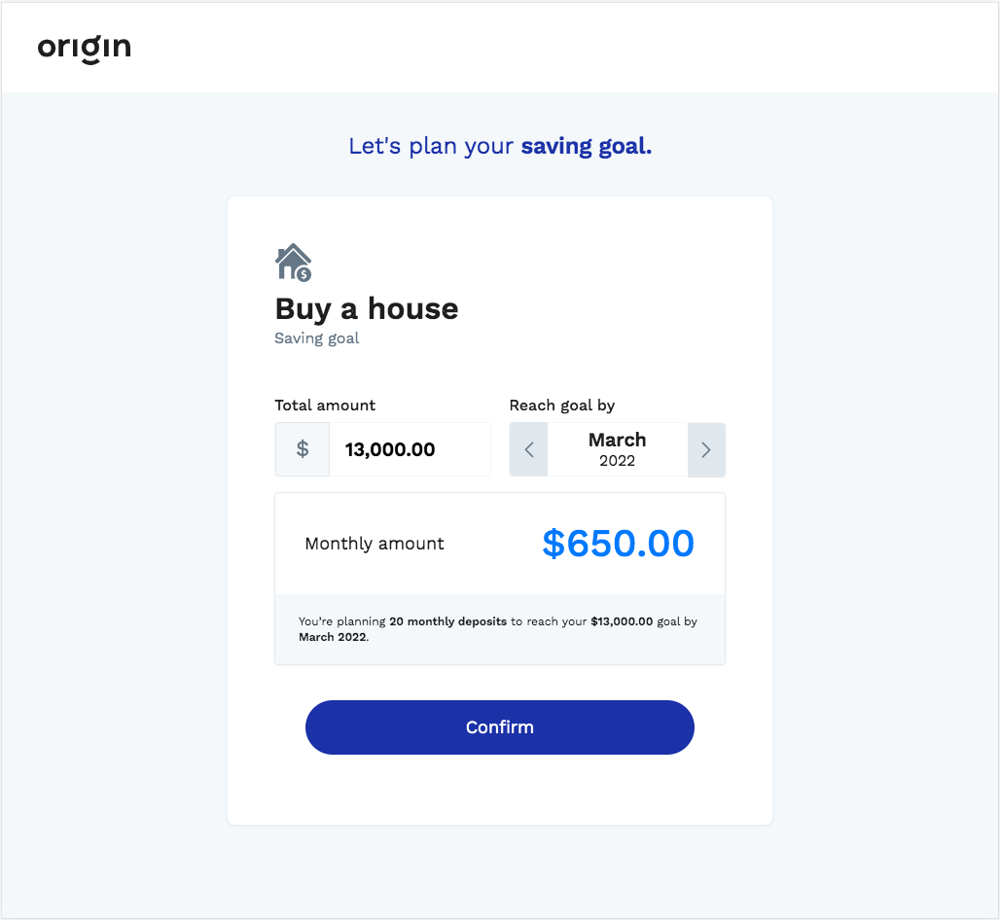
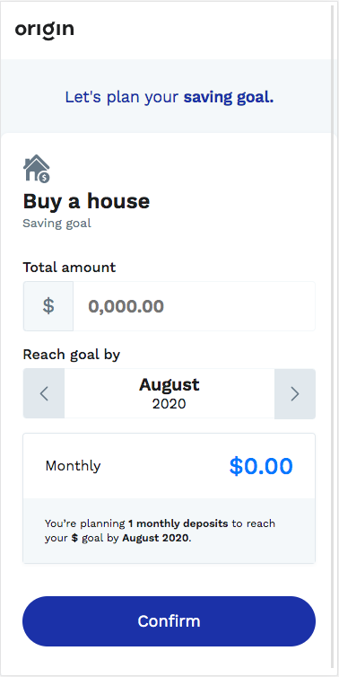

# OriginAngular
This is a piece of the savings feature of the finacial solution from origin.

## Local development
Run `npm install` to install project dependencies.
Run `ng serve` for a dev server. 
The project will be available on `localhost:4200`. 

> Obs.: To access the platform from a mobile device run `ng serve --host 0.0.0.0`, as long as you are in the same network, just go to the browser and access `<your-ip-address>:4200`.

## Linting
Run `ng lint`.

## Unit tests

Run `ng test` .

## Desktop 

## Mobile

